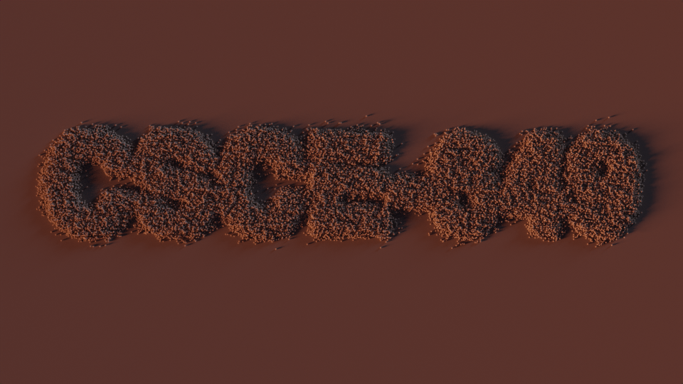
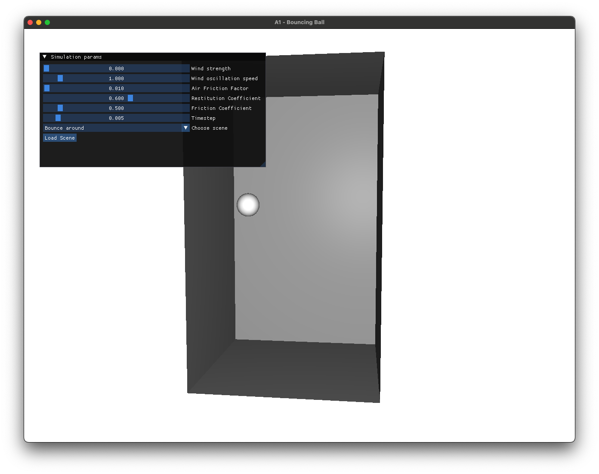
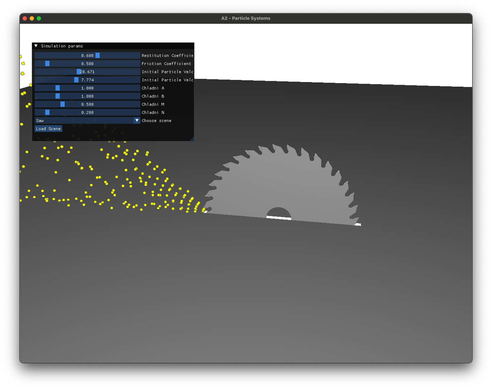
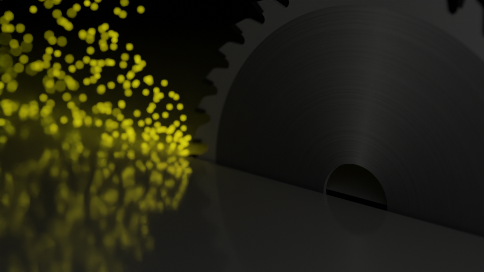
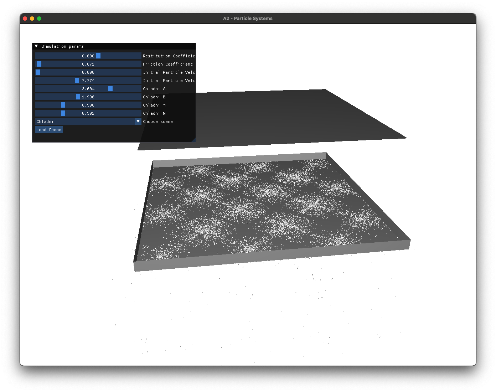
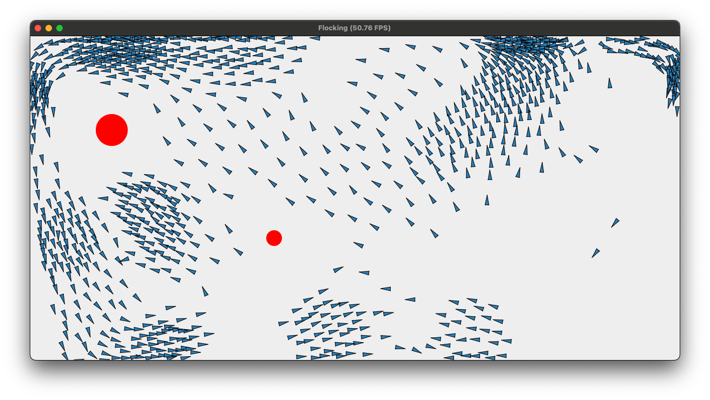
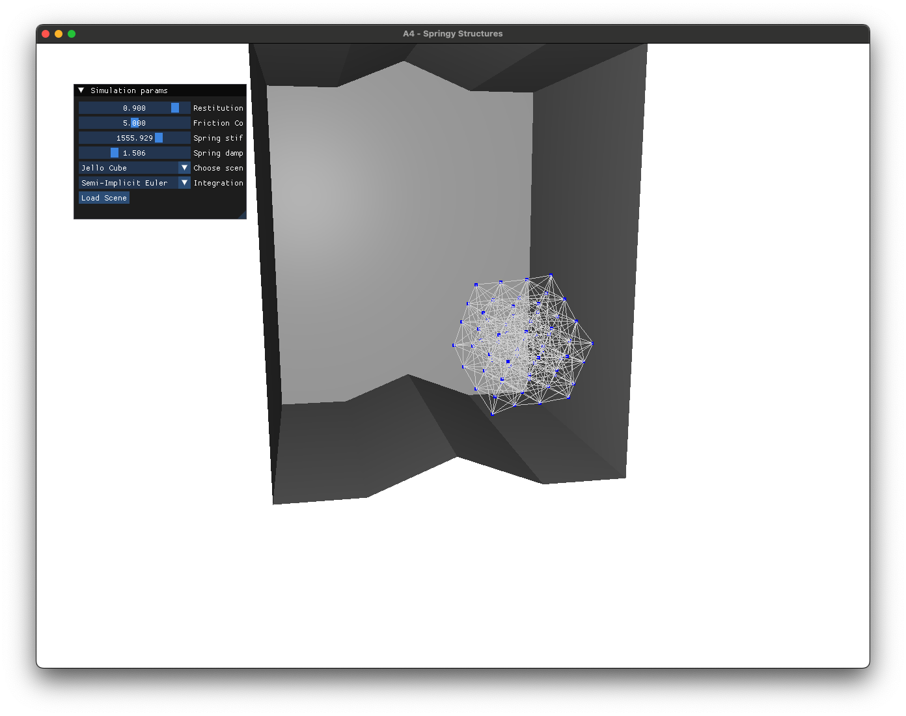
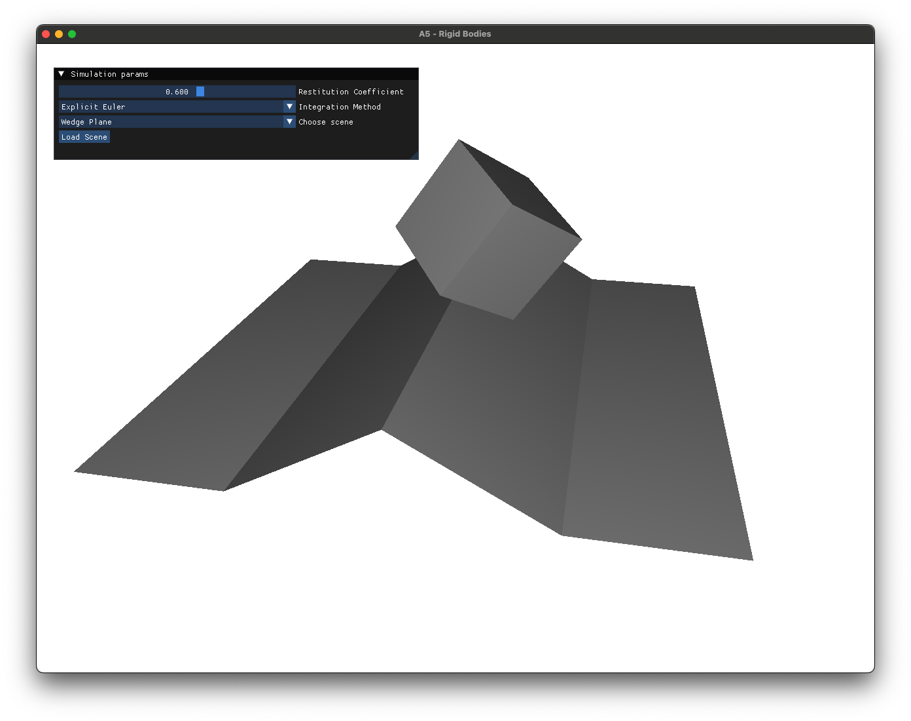
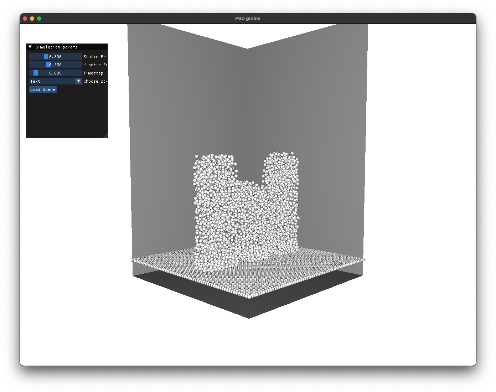
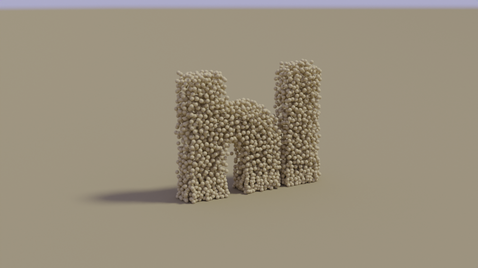

# CSCE-649-Physically-Based-Modeling



This is a collection of assignments done as part of the Physically Based Modeling course at Texas A&M University.
Each assignment is in a self contained directory.

## How to build and run

From the directory of any assignment run:

```console
mkdir build
cd build
cmake -DCMAKE_BUILD_TYPE=Release ..
make -j4
./<application-name> ../resources ../data
```

## Assignments

### A1 - Bouncing Ball


### A2 - Particle Systems

Sparks             |  Sparks Rendered
:-------------------------:|:-------------------------:
  |  

Chladni Plate             | 
:-------------------------:|
  |

### A3 - Flocking




### A4 - Springy Structures




### A5 - Rigid Bodies




### Final Project - PBD Granular Material Simulation

Grains             |  Grains Rendered
:-------------------------:|:-------------------------:
  |  
